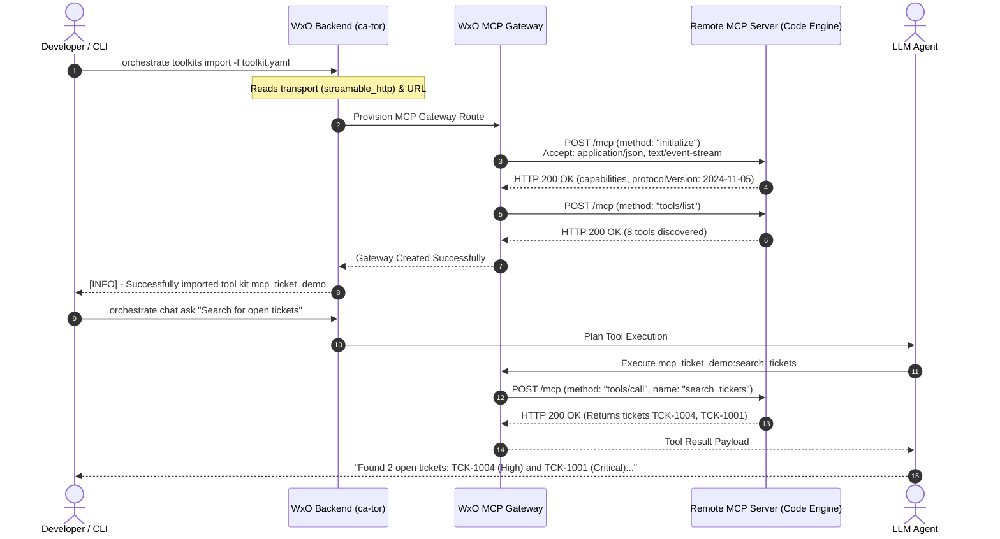
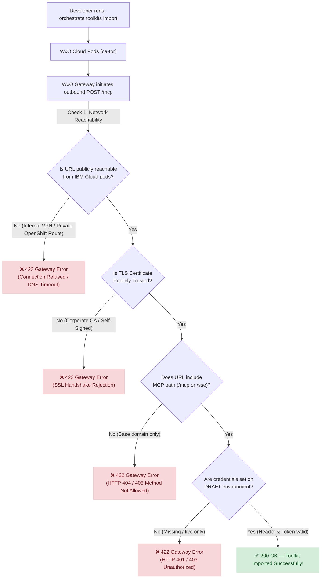

# 🎓 WXO Labs & Tutorial Guide
## From Zero to Hero: Hands-On Learning Path

**Author:** Markus van Kempen | mvk@ca.ibm.com  
[Research | Floor 7½ 🏢🤏](https://markusvankempen.github.io/)  
*No bug too small, no syntax too weird.*

---

## 📚 Table of Contents

- [Introduction](#introduction)
- [Prerequisites & Setup](#prerequisites--setup)
- [Learning Path Overview](#learning-path-overview)
- [🟢 Easy Labs (Beginner)](#-easy-labs-beginner)
  - [Lab 1: Hello World](#lab-1-hello-world---your-first-wxo-tool)
  - [Lab 2: Input Defaults](#lab-2-input-defaults--ui-patterns)
  - [Lab 3: File Upload](#lab-3-file-upload--processing)
- [🟡 Intermediate Labs](#-intermediate-labs)
  - [Lab 4: Context Injection](#lab-4-context-injection--variables)
  - [Lab 5: Async Tools](#lab-5-async-tools--long-running-jobs)
  - [Lab 6: File Downloads](#lab-6-file-downloads--streaming)
  - [Lab 7: MCP Basics](#lab-7-mcp-basics---your-first-mcp-server)
  - [Lab 8: MCP Advanced](#lab-8-mcp-advanced---user-context--credentials)
- [🔴 Advanced Labs](#-advanced-labs)
  - [Lab 9: RBAC Plugin](#lab-9-rbac-plugin---role-based-access-control)
  - [Lab 10: SSO Integration](#lab-10-sso-integration-with-microsoft-entra-id)
  - [Lab 11: Agent Export/Import](#lab-11-agent-exportimport--cicd)
  - [Lab 15: External Remote MCP Server Integration](#lab-15-external-remote-mcp-server-integration---streamable-http-sse--live-observability)
  - [Lab 16: IBM Planning Analytics MCP Enterprise Integration](#lab-16-ibm-planning-analytics-tm1-mcp-enterprise-integration)
- [🏆 Expert Labs (Mastery)](#-expert-labs-mastery)
  - [Lab 12: Conversation Logging](#lab-12-conversation-logging--audit-vault)
  - [Lab 13: Observability Dashboard](#lab-13-observability-dashboard)
  - [Lab 14: RAG Evaluation](#lab-14-rag-evaluation-pipeline)
- [Quick Reference](#quick-reference)
- [Troubleshooting Guide](#troubleshooting-guide)

---

## Introduction

This comprehensive tutorial guide transforms the **WXO Test Tools & Patterns Library** into a structured learning journey. Each lab builds upon previous concepts, taking you from basic tool creation to advanced enterprise patterns like SSO integration, RBAC, and observability.

### 🎯 Learning Objectives

By completing these labs, you will:
- ✅ Master the WXO CLI and Python tool development
- ✅ Understand agent architecture and tool orchestration
- ✅ Implement security patterns (SSO, RBAC, audit logging)
- ✅ Build production-ready integrations with files, APIs, and databases
- ✅ Master Model Context Protocol (MCP) for external system integration
- ✅ Debug and monitor complex agent workflows
- ✅ Deploy enterprise-grade solutions with proper error handling

### 📊 Difficulty Legend

| Symbol | Level | Description | Time Range |
|:------:|:------|:------------|:-----------|
| 🟢 | **Easy** | Foundational concepts, basic tool creation | 30-60 min |
| 🟡 | **Intermediate** | Multi-tool workflows, integrations, patterns | 1-2 hours |
| 🔴 | **Advanced** | Security, performance, complex architectures | 2-4 hours |
| 🏆 | **Expert** | Production systems, full-stack solutions | 4+ hours |

---

## Prerequisites & Setup

### Required Software

```bash
# 1. Python 3.9+ with pip
python3 --version

# 2. IBM Watsonx Orchestrate CLI (v2.9.0+)
pip install ibm-watsonx-orchestrate

# 3. Verify installation
orchestrate --version

# 4. Configure your environment
orchestrate env activate
```

### Environment Configuration

```bash
# Set up your WXO credentials
export WXO_API_KEY="your-api-key"
export WXO_TENANT_URL="https://your-tenant.watsonx.cloud.ibm.com"

# Optional: Create a dedicated workspace
mkdir -p ~/wxo-labs
cd ~/wxo-labs
```

### Recommended Tools

- **Code Editor:** VS Code with Python extension
- **Terminal:** bash/zsh with command history
- **Browser:** Chrome/Firefox for testing agents
- **Optional:** ngrok for webhook testing (Advanced labs)

### Knowledge Prerequisites

| Level | Required Knowledge |
|:------|:-------------------|
| 🟢 Easy | Basic Python, command line usage |
| 🟡 Intermediate | REST APIs, JSON/YAML, async concepts |
| 🔴 Advanced | OAuth/SSO, security patterns, system design |
| 🏆 Expert | Distributed systems, observability, production ops |

---

## Learning Path Overview

The labs are organized in a progressive learning path. Each lab builds on concepts from previous labs:

**🟢 Foundation (Labs 1-3):** Core WXO concepts, tool creation, basic patterns  
**🟡 Integration (Labs 4-6):** Context management, async operations, file handling  
**🔴 Security & Scale (Labs 7-9):** RBAC, SSO, deployment automation  
**🏆 Production (Labs 10-12):** Monitoring, logging, evaluation pipelines

### Recommended Learning Paths

**Path A - Developer Track (Focus: Building Tools)**
1. Lab 1 → Lab 2 → Lab 3 → Lab 5 → Lab 6 → Lab 9

**Path B - Security Track (Focus: Enterprise Integration)**
1. Lab 1 → Lab 4 → Lab 9 → Lab 10 → Lab 10

**Path C - Full Stack (Complete Journey)**
1. All labs in sequence (1-12)

---

## 🟢 Easy Labs (Beginner)

### Lab 1: Hello World - Your First WXO Tool
**⏱️ Duration:** 30 minutes  
**📁 Reference:** [`hello_world_tutorial/`](./hello_world_tutorial/)  
**🎯 Learning Goals:** Tool structure, CLI basics, agent creation

#### Real-World Scenario
You're building a simple greeting service for your company's internal chatbot. The bot should welcome users by name when they interact with it.

#### What You'll Build
A Python tool that generates personalized greetings and an agent that uses this tool to welcome users.

#### Step-by-Step Instructions

**Step 1: Create Your First Tool**

Create a file named `greetings.py`:

```python
from ibm_watsonx_orchestrate import tool

@tool
def greet_user(name: str) -> str:
    """
    Generate a personalized greeting for a user.
    
    Args:
        name: The name of the person to greet
        
    Returns:
        A friendly greeting message
    """
    return f"Hello World, welcome to Watsonx Orchestrate, {name}!"
```

**Step 2: Create Requirements File**

Create `requirements.txt`:

```txt
ibm-watsonx-orchestrate>=2.9.0
```

**Step 3: Import the Tool**

```bash
# Import the tool into WXO
orchestrate tools import -k python -f greetings.py -r requirements.txt

# Verify the import
orchestrate tools list | grep greet_user
```

**Step 4: Create an Agent**

Create `hello_world_agent.yaml`:

```yaml
name: hello_world_greeter
title: Hello World Greeter
description: A friendly agent that greets users
model: ibm/granite-3-8b-instruct
instructions: |
  You are a friendly assistant. When a user asks you to greet someone,
  use the greet_user tool to generate a personalized greeting.
tools:
  - greet_user
```

**Step 5: Import and Test**

```bash
# Import the agent
orchestrate agents import -f hello_world_agent.yaml

# Test via CLI
orchestrate chat ask -n hello_world_greeter "Say hello to Alice"
```

#### ✅ Success Criteria
- [ ] Tool imports without errors
- [ ] Agent successfully calls the tool
- [ ] Greeting includes the user's name
- [ ] You can modify the greeting and re-import

#### 🔧 Troubleshooting

**Issue:** `ModuleNotFoundError: No module named 'ibm_watsonx_orchestrate'`

**Solution:** Always include `-r requirements.txt` when importing:
```bash
orchestrate tools import -k python -f greetings.py -r requirements.txt
```

**Issue:** Agent doesn't call the tool

**Solution:** Make your instructions more explicit:
```yaml
instructions: |
  When the user asks to greet someone, you MUST use the greet_user tool.
  Extract the name from the user's message and pass it to the tool.
```

#### 🎯 Challenge Exercise
Extend the tool to accept an optional `language` parameter and return greetings in English, Spanish, or French.

---

### Lab 2: Input Defaults & UI Patterns
**⏱️ Duration:** 45 minutes  
**📁 Reference:** [`input_default_test/`](./input_default_test/)  
**🎯 Learning Goals:** Pydantic models, default values, field validation

#### Real-World Scenario
Build a financial approval tool where the system pre-fills the approval amount based on previous calculations, but users can override if needed.

#### What You'll Build
A tool with smart defaults that improve user experience by reducing manual data entry.

#### Key Concepts
- **Pydantic Models:** Type-safe input schemas
- **Field Defaults:** Pre-populated values in the UI
- **Validation:** Automatic input checking

#### Implementation

Create `financial_tool.py`:

```python
from ibm_watsonx_orchestrate import tool
from pydantic import BaseModel, Field

class FinancialApprovalInput(BaseModel):
    """Input schema for financial approval"""
    amount: float = Field(
        default=1000.0,
        description="The amount to approve (USD)",
        ge=0.0,
        le=1000000.0
    )
    reason: str = Field(
        default="Standard approval",
        description="Reason for the approval request"
    )
    urgent: bool = Field(
        default=False,
        description="Mark as urgent for expedited processing"
    )

@tool
def request_financial_approval(input: FinancialApprovalInput) -> str:
    """Submit a financial approval request with pre-filled defaults."""
    urgency = "🚨 URGENT" if input.urgent else "📋 Standard"
    
    return f"""
{urgency} Financial Approval Request Submitted

Amount: ${input.amount:,.2f}
Reason: {input.reason}
Status: Pending Review

Your request has been forwarded to the finance team.
"""
```

#### Testing

```bash
# Import
orchestrate tools import -k python -f financial_tool.py -r requirements.txt

# Create agent
orchestrate agents create -n "finance_assistant" \
  --title "Finance Assistant" \
  --instructions "Help users submit financial approval requests" \
  --tools request_financial_approval

# Test
orchestrate chat ask -n finance_assistant "I need approval for $5000 for new equipment"
```

#### ✅ Success Criteria
- [ ] Default values appear in the UI
- [ ] Validation prevents invalid amounts
- [ ] Agent processes requests correctly
- [ ] Error messages are clear

#### 🎯 Challenge Exercise
Add a `department` field with a dropdown of valid departments using Pydantic's `Literal` type.

---

### Lab 3: File Upload & Processing
**⏱️ Duration:** 60 minutes  
**📁 Reference:** [`file_upload_test/`](./file_upload_test/)  
**🎯 Learning Goals:** File handling, pandas, data processing

#### Real-World Scenario
HR needs to process employee data from Excel spreadsheets uploaded by managers.

#### What You'll Build
A tool that reads Excel files, analyzes the data, and returns insights.

#### Implementation

Create `file_processor.py`:

```python
from ibm_watsonx_orchestrate import tool
import pandas as pd

@tool
def analyze_employee_data(file_path: str) -> str:
    """
    Analyze employee data from an uploaded Excel file.
    
    Args:
        file_path: Path to the uploaded Excel file
        
    Returns:
        Summary statistics and insights
    """
    try:
        df = pd.read_excel(file_path)
        
        total_employees = len(df)
        columns = ", ".join(df.columns.tolist())
        
        summary = f"""
📊 Employee Data Analysis

Total Records: {total_employees}
Columns: {columns}

Sample Data (first 3 rows):
{df.head(3).to_string()}
"""
        return summary
        
    except Exception as e:
        return f"❌ Error processing file: {str(e)}"
```

Create `requirements.txt`:

```txt
ibm-watsonx-orchestrate>=2.9.0
pandas>=2.0.0
openpyxl>=3.1.0
```

#### Testing Locally

Create test data:

```python
# create_sample.py
import pandas as pd

data = {
    'Employee_ID': [1001, 1002, 1003],
    'Name': ['Alice Johnson', 'Bob Smith', 'Carol White'],
    'Department': ['Engineering', 'Sales', 'HR'],
    'Salary': [95000, 75000, 65000]
}

df = pd.DataFrame(data)
df.to_excel('sample_employees.xlsx', index=False)
```

Test locally:

```bash
python3 create_sample.py
python3 -c "from file_processor import analyze_employee_data; print(analyze_employee_data('sample_employees.xlsx'))"
```

#### Deploy and Test

```bash
orchestrate tools import -k python -f file_processor.py -r requirements.txt

orchestrate agents create -n "hr_data_analyst" \
  --title "HR Data Analyst" \
  --instructions "Analyze employee data from uploaded Excel files" \
  --tools analyze_employee_data
```

#### ✅ Success Criteria
- [ ] Tool reads Excel files correctly
- [ ] Handles file uploads from chat UI
- [ ] Returns formatted summary
- [ ] Gracefully handles errors

#### 🎯 Challenge Exercise
Add salary analysis: calculate average by department, identify outliers, and generate a summary report.

---

## 🟡 Intermediate Labs

### Lab 4: Context Injection & Variables
**⏱️ Duration:** 90 minutes  
**📁 Reference:** [`context_injection_test/`](./context_injection_test/), [`askhr_context_variables_test/`](./askhr_context_variables_test/)  
**🎯 Learning Goals:** AgentRun context, state management, data flow

#### Real-World Scenario
Build an HR assistant that remembers user information across interactions without asking repeatedly.

#### Critical Pattern: The AgentRun Import Workaround

```python
# ALWAYS use this pattern for context-aware tools
try:
    from ibm_watsonx_orchestrate.run.context import AgentRun
except ImportError:
    # Fallback for cloud runtime
    AgentRun = object
```

**Why?** The cloud sandbox doesn't load the full `run.context` module but injects a duck-typed context object at runtime.

#### Implementation

```python
# context_aware_tool.py
try:
    from ibm_watsonx_orchestrate.run.context import AgentRun
except ImportError:
    AgentRun = object

from ibm_watsonx_orchestrate import tool

@tool(context_access_enabled=True)
def get_user_profile(agent_run: AgentRun) -> str:
    """Retrieve user profile from context."""
    context = agent_run.context if hasattr(agent_run, 'context') else {}
    
    user_email = context.get('wxo_email_id', 'unknown@example.com')
    employee_id = context.get('employee_id', 'Not Set')
    department = context.get('department', 'Not Set')
    
    return f"""
👤 User Profile

Email: {user_email}
Employee ID: {employee_id}
Department: {department}
"""

@tool(context_access_enabled=True)
def set_user_context(
    agent_run: AgentRun,
    employee_id: str,
    department: str
) -> str:
    """Store user information in context."""
    return f"""
✅ Context Updated

Employee ID: {employee_id}
Department: {department}

This information is now available for future interactions.
"""
```

#### Agent Configuration

```yaml
# hr_assistant_agent.yaml
name: hr_context_assistant
title: HR Context Assistant
model: ibm/granite-3-8b-instruct
instructions: |
  You are an HR assistant. Use get_user_profile to retrieve user info.
  Use set_user_context to store new information.
tools:
  - get_user_profile
  - set_user_context
context_variables:
  employee_id: ""
  department: ""
```

#### ✅ Success Criteria
- [ ] No `ModuleNotFoundError` in cloud execution
- [ ] Context persists across tool calls
- [ ] Agent personalizes responses using context

#### 🎯 Challenge Exercise
Build a multi-step workflow where Tool A collects preferences, Tool B filters results, and Tool C generates a report—all without re-asking for information.

---

### Lab 5: Async Tools & Long-Running Jobs
**⏱️ Duration:** 120 minutes  
**📁 Reference:** [`async_tool/`](./async_tool/)  
**🎯 Learning Goals:** Background jobs, polling, non-blocking execution

#### Real-World Scenario
Generate large reports that take 5-10 minutes. Users should continue chatting while jobs run in the background.

#### Architecture Pattern

```
User: "Start report generation"
  ↓
Agent calls start_background_job()
  ↓
Job runs in background thread
  ↓
Agent responds: "Job started! Job ID: abc123"
  ↓
User continues chatting (not blocked!)
  ↓
User: "Check job status for abc123"
  ↓
Agent calls check_job_status("abc123")
  ↓
Agent responds: "Complete!" or "Still running..."
```

#### Implementation

```python
# async_tools.py
from ibm_watsonx_orchestrate import tool
import threading
import uuid
import time
from datetime import datetime

# In-memory job store (use Redis in production)
JOBS = {}

@tool
def start_background_job(
    job_name: str,
    duration_seconds: int = 30
) -> str:
    """Start a long-running background job without blocking."""
    job_id = str(uuid.uuid4())[:8]
    
    JOBS[job_id] = {
        'id': job_id,
        'name': job_name,
        'status': 'running',
        'created_at': datetime.now().isoformat()
    }
    
    def run_job():
        time.sleep(duration_seconds)
        JOBS[job_id]['status'] = 'completed'
        JOBS[job_id]['result'] = f"Report generated for {job_name}"
    
    thread = threading.Thread(target=run_job)
    thread.daemon = True
    thread.start()
    
    return f"""
✅ Background Job Started

Job ID: {job_id}
Job Name: {job_name}
Estimated Duration: {duration_seconds} seconds

Keep chatting! Check status with: "Check job {job_id}"
"""

@tool
def check_job_status(job_id: str) -> str:
    """Check the status of a background job."""
    job = JOBS.get(job_id)
    
    if not job:
        return f"❌ Job {job_id} not found"
    
    if job['status'] == 'running':
        return f"🔄 Job {job_id} is still running..."
    
    return f"""
🎉 Job {job_id} completed!

Result: {job.get('result', 'No result')}
"""
```

#### Testing

```bash
orchestrate tools import -k python -f async_tools.py -r requirements.txt

orchestrate agents create -n "job_manager" \
  --title "Background Job Manager" \
  --tools start_background_job check_job_status

# Test the flow
orchestrate chat ask -n job_manager "Start a job for 30 seconds"
# Continue chatting...
orchestrate chat ask -n job_manager "Tell me a joke"
# Check status after 30+ seconds
orchestrate chat ask -n job_manager "Check job status for <job_id>"
```

#### ✅ Success Criteria
- [ ] Jobs start immediately without blocking
- [ ] Users can chat normally while jobs run
- [ ] Status checks return accurate information
- [ ] Completed jobs show results

#### 🎯 Challenge Exercise
Add job cancellation and implement a job queue with priority levels.

---

### Lab 6: File Downloads & Streaming
**⏱️ Duration:** 90 minutes  
**📁 Reference:** [`download_file_and_stream_e2e_test/`](./download_file_and_stream_e2e_test/)  
**🎯 Learning Goals:** File generation, download links, binary data

#### Real-World Scenario
Generate PDF reports and provide download links to users.

#### Implementation

```python
# pdf_generator.py
from ibm_watsonx_orchestrate import tool
from reportlab.lib.pagesizes import letter
from reportlab.pdfgen import canvas
import tempfile
import os
from datetime import datetime

@tool
def generate_report_pdf(
    report_title: str,
    content: str
) -> str:
    """Generate a PDF report and return a download link."""
    temp_dir = tempfile.gettempdir()
    filename = f"report_{datetime.now().strftime('%Y%m%d_%H%M%S')}.pdf"
    filepath = os.path.join(temp_dir, filename)
    
    # Generate PDF
    c = canvas.Canvas(filepath, pagesize=letter)
    width, height = letter
    
    c.setFont("Helvetica-Bold", 24)
    c.drawString(50, height - 50, report_title)
    
    c.setFont("Helvetica", 12)
    text_object = c.beginText(50, height - 100)
    text_object.textLines(content)
    c.drawText(text_object)
    
    c.save()
    
    return f"""
📄 PDF Report Generated

Title: {report_title}
File: {filename}
Size: {os.path.getsize(filepath)} bytes

Download: file://{filepath}
"""
```

Requirements:

```txt
ibm-watsonx-orchestrate>=2.9.0
reportlab>=4.0.0
```

#### ✅ Success Criteria
- [ ] PDFs generate correctly
- [ ] Download links are provided
- [ ] Files contain formatted content

#### 🎯 Challenge Exercise
Upload generated PDFs to S3 and return HTTPS URLs instead of local file paths.


## Lab 7: MCP Basics - Your First MCP Server

**Difficulty:** 🟡 Intermediate  
**Time:** 90 minutes  
**Prerequisites:** Labs 1-8, understanding of HTTP/REST APIs

### 🎯 Learning Objectives

By the end of this lab, you will:
- ✅ Understand what MCP (Model Context Protocol) is and why it matters
- ✅ Create a simple MCP server with STDIO transport
- ✅ Deploy an MCP toolkit to WXO using `--package-root`
- ✅ Debug common MCP discovery issues ("0 tools found")
- ✅ Test MCP tools via CLI and UI

### 📚 What is MCP?

**Model Context Protocol (MCP)** is an open standard that enables AI assistants to securely connect to external data sources and tools. Unlike Python tools that run inside WXO's sandbox, MCP tools run as **separate processes** (sidecars) that communicate via:

- **STDIO** (stdin/stdout) - for local development
- **SSE** (Server-Sent Events over HTTP) - for production deployments

### 🏗️ Architecture Comparison

| Feature | Python Tool (`@tool`) | MCP Tool |
|---------|----------------------|----------|
| **Runs in** | WXO Python sandbox | Separate sidecar process |
| **Transport** | Direct function call | JSON-RPC over STDIO/SSE |
| **Credentials** | `connections.key_value()` | Environment variables |
| **Deployment** | `orchestrate tools import` | `orchestrate toolkits add --kind mcp` |
| **Use case** | Simple transformations | External system integration |

### 📂 Lab Files

Navigate to: `mcp_discovery_test/`

Key files:
- `simple_mcp_server.py` - Minimal MCP server
- `run_stdio.sh` - Shell wrapper for STDIO transport
- `mcp_repro_agent.json` - Agent definition
- `validate_end_to_end.sh` - Deployment script

### 🔨 Step 1: Understand the MCP Server

Read `simple_mcp_server.py`:

```python
from mcp.server import Server
from mcp.server.stdio import stdio_server
import mcp.types as types

# Create MCP server instance
mcp = Server("simple-mcp-server")

@mcp.tool()
async def get_repro_data(query: str) -> str:
    """
    Simple MCP tool that echoes back the query.
    This proves discovery and execution are working.
    """
    return f"✅ MCP Server Received Query: '{query}'. Discovery and Execution are WORKING!"

# Run server with STDIO transport
async def main():
    async with stdio_server() as (read_stream, write_stream):
        await mcp.run(
            read_stream,
            write_stream,
            mcp.create_initialization_options()
        )

if __name__ == "__main__":
    import asyncio
    asyncio.run(main())
```

**Key concepts:**
- `@mcp.tool()` decorator registers tools (similar to `@tool` in Python tools)
- `stdio_server()` creates STDIO transport for JSON-RPC communication
- Tools are async functions (use `async def`)

### 🔨 Step 2: Test Locally (STDIO)

Before deploying to WXO, test the server locally:

```bash
cd mcp_discovery_test

# Install MCP SDK
pip install mcp

# Make scripts executable
chmod +x run_stdio.sh validate_end_to_end.sh

# Test STDIO communication
echo '{"jsonrpc":"2.0","id":1,"method":"tools/list"}' | python simple_mcp_server.py
```

**Expected output:**
```json
{
  "jsonrpc": "2.0",
  "id": 1,
  "result": {
    "tools": [
      {
        "name": "get_repro_data",
        "description": "Simple MCP tool that echoes back the query.",
        "inputSchema": {
          "type": "object",
          "properties": {
            "query": {"type": "string"}
          },
          "required": ["query"]
        }
      }
    ]
  }
}
```

### 🔨 Step 3: Deploy to WXO

**⚠️ Critical: The `--package-root` Flag**

The #1 cause of "0 tools discovered" is forgetting `--package-root`. WXO runs in the cloud and cannot access your local `/Users/...` paths.

```bash
# Activate your WXO environment
orchestrate env activate

# Deploy the MCP toolkit (uploads code to cloud)
orchestrate toolkits add \
  --kind mcp \
  --name simple-mcp-toolkit \
  --package-root . \
  --command "bash run_stdio.sh" \
  --tools "*"
```

**What happens:**
1. CLI zips your current directory (`.`)
2. Uploads ZIP to WXO cloud container
3. WXO extracts ZIP and runs `bash run_stdio.sh`
4. Server starts and responds to `tools/list` JSON-RPC call

### 🔨 Step 4: Import the Agent

```bash
orchestrate agents import --file mcp_repro_agent.json
orchestrate agents deploy -n mcp_repro_agent
```

### 🔨 Step 5: Test via CLI

```bash
orchestrate chat ask -n mcp_repro_agent "Is the MCP server working?"
```

**Expected response:**
```
╭─ 🤖 mcp_repro_agent ─────────────────────────────────╮
│  Discovery and Execution are WORKING!                │
╰──────────────────────────────────────────────────────╯
```

### 🐛 Troubleshooting

#### Problem: "0 tools discovered"

**Cause:** Missing `--package-root` or incorrect command path

**Solution:**
```bash
# Check toolkit status
orchestrate toolkits list

# Re-add with --package-root
orchestrate toolkits remove -n simple-mcp-toolkit
orchestrate toolkits add \
  --kind mcp \
  --name simple-mcp-toolkit \
  --package-root . \
  --command "bash run_stdio.sh" \
  --tools "*"
```

#### Problem: "Server not responding"

**Cause:** Python dependencies missing in cloud container

**Solution:** Add `requirements.txt`:
```txt
mcp>=1.0.0
```

Then re-deploy with `--package-root .`

### ✅ Success Criteria

- [ ] MCP server runs locally and responds to `tools/list`
- [ ] Toolkit deployed with `--package-root` flag
- [ ] Agent successfully calls `get_repro_data` tool
- [ ] CLI chat returns "WORKING!" message
- [ ] Understand STDIO vs SSE transport differences

### 🎓 Key Takeaways

1. **MCP tools run as separate processes** - not in WXO's Python sandbox
2. **Always use `--package-root`** - WXO needs to upload your code
3. **STDIO for local dev, SSE for production** - choose transport based on deployment
4. **JSON-RPC protocol** - tools communicate via standardized messages

### 🚀 Challenge Exercise

Modify `simple_mcp_server.py` to add a second tool:

```python
@mcp.tool()
async def get_system_info() -> dict:
    """Returns information about the MCP server environment."""
    import os
    import platform
    return {
        "python_version": platform.python_version(),
        "platform": platform.system(),
        "env_vars_count": len(os.environ),
        "working_directory": os.getcwd()
    }
```

Deploy and test: `"Show me system info"`

---

## Lab 8: MCP Advanced - User Context & Credentials

**Difficulty:** 🔴 Advanced  
**Time:** 120 minutes  
**Prerequisites:** Lab 9, understanding of OAuth/JWT

### 🎯 Learning Objectives

By the end of this lab, you will:
- ✅ Inject user identity into MCP tools via Bearer tokens
- ✅ Configure WXO connections for MCP toolkits
- ✅ Extract and decode JWT tokens in MCP servers
- ✅ Implement secure credential passing patterns
- ✅ Deploy production-ready MCP servers with ngrok/SSE

### 📚 The Identity Challenge

When a user invokes an MCP tool, the tool often needs to know:
- **Who** is making the request (for audit trails)
- **What** they're authorized to do (for RBAC)
- **How** to act on their behalf (for downstream systems like SAP/Maximo)

### 🏗️ Two Identity Patterns

#### Pattern 1: Transport Level (Bearer Token in HTTP Header) ✅ Recommended

WXO injects the Bearer token at the HTTP layer. The tool server reads `request.headers.get("Authorization")`. The LLM never sees the raw token.

```
WxO Runtime → HTTP GET /check-identity
              Authorization: Bearer eyJraWQiOiJ2MWJk...
                                     ↑ injected by WXO Connection
MCP Server ← extracts token, decodes JWT, returns username
```

#### Pattern 2: Application Level (Parameter Injection)

WXO injects the user's email as a hidden tool argument via `{{user.email}}` mapping.

```
WxO Runtime → calls tool with arguments:
              {"injected_user_id": "mvk@ca.ibm.com"}
                                    ↑ injected by Skill Settings
```

### 📂 Lab Files

Navigate to: `mcp_user_context_test/`

Key files:
- `mcp_sse_server.py` - SSE server with Bearer token extraction
- `mcp_context_openapi.json` - OpenAPI spec with `bearerAuth`
- `mcp_agent_def.yaml` - Agent definition
- `deploy_to_wxo.sh` - Automated deployment script

### 🔨 Step 1: Understand Bearer Token Extraction

Read `mcp_sse_server.py` (simplified):

```python
from starlette.applications import Starlette
from starlette.routing import Route
import base64
import json

def _decode_jwt_payload(token: str) -> dict:
    """Decode JWT payload without signature verification."""
    parts = token.split(".")  # header.payload.signature
    padded = parts[1] + "=" * (4 - len(parts[1]) % 4)
    return json.loads(base64.b64decode(padded))

async def check_identity(request):
    """Extract user identity from Authorization header."""
    auth_header = request.headers.get("Authorization", "")
    
    if not auth_header.startswith("Bearer "):
        return {"status": "warning", "username": "NOT_FOUND"}
    
    token = auth_header.split(" ", 1)[1]
    claims = _decode_jwt_payload(token)
    
    username = (
        claims.get("email") or 
        claims.get("preferred_username") or 
        claims.get("sub")
    )
    
    return {
        "status": "success",
        "username": username,
        "token_preview": token[:50] + "...",
        "pattern": "Pattern 1 - Transport Level Header Propagation"
    }

app = Starlette(routes=[
    Route("/check-identity", check_identity, methods=["GET"])
])
```

**Key concepts:**
- JWT tokens are base64-encoded (not encrypted)
- No signature verification needed to read claims
- `email` claim contains user identity

### 🔨 Step 2: Set Up ngrok Tunnel

MCP SSE servers need a public URL for WXO to reach them:

```bash
# Install ngrok
brew install ngrok/ngrok/ngrok

# Start tunnel
ngrok http 8000

# Copy the HTTPS URL (e.g., https://abc123.ngrok-free.app)
```

Update `mcp_context_openapi.json`:
```json
{
  "servers": [
    {"url": "https://abc123.ngrok-free.app"}
  ]
}
```

### 🔨 Step 3: Create WXO Connection

This connection stores the Bearer token that WXO will inject:

```bash
# Create .env file with your credentials
cat > .env << 'EOF'
WO_INSTANCE_URL=https://api.dl.watson-orchestrate.ibm.com/instances/<your-instance>
WO_TRIAL_API_KEY=<your-api-key>
EOF

source .env

# 1. Register connection
orchestrate connections add --app-id mcp_ctx_bearer

# 2. Configure as Bearer token connection
orchestrate connections configure \
  --app-id mcp_ctx_bearer --env draft \
  --type team --kind bearer \
  --server-url "https://abc123.ngrok-free.app"

# 3. Exchange API key for JWT
REAL_JWT=$(curl -s -X POST \
  "https://iam.platform.saas.ibm.com/siusermgr/api/1.0/apikeys/token" \
  -H "Content-Type: application/json" \
  -d "{\"apikey\": \"${WO_TRIAL_API_KEY}\"}" \
  | python3 -c "import sys,json; print(json.load(sys.stdin)['token'])")

# 4. Store JWT in connection
orchestrate connections set-credentials \
  --app-id mcp_ctx_bearer --env draft --token "$REAL_JWT"
```

### 🔨 Step 4: Deploy Tool and Agent

```bash
# Start MCP server locally
python mcp_sse_server.py &

# Import OpenAPI tool (linked to connection)
orchestrate tools import \
  --file mcp_context_openapi.json \
  --kind openapi \
  --app-id mcp_ctx_bearer

# Import and deploy agent
orchestrate agents import --file mcp_agent_def.yaml
orchestrate agents deploy -n mcp_auth_tester_agent
```

### 🔨 Step 5: Test Identity Extraction

```bash
orchestrate chat ask -n mcp_auth_tester_agent "check identity"
```

**Expected response:**
```
╭─ 🤖 mcp_auth_tester_agent ───────────────────────────╮
│  - Status: ✅ Success                                │
│  - Pattern Used: Pattern 1 – Transport Level         │
│  - Username: your-email@ibm.com                      │
│  - Token Preview: eyJraWQiOiJ2MWJk...                │
╰──────────────────────────────────────────────────────╯
```

### 🔨 Step 6: Understand Connection Mapping (Key-Value Pattern)

For MCP tools that need API keys or database credentials, use **key-value connections**:

Navigate to: `mcp_connection_mapping_issue/`

**❌ Wrong (doesn't work in MCP):**
```python
from ibm_watsonx_orchestrate.run import connections

def get_creds():
    creds = connections.key_value(WATSONX_APP_ID)  # ← Returns nothing!
```

**✅ Correct (works in MCP):**
```python
import os

def get_creds():
    required_keys = ["BASE_URL", "API_KEY", "USER_NAME"]
    creds = {k: os.environ.get(k) for k in required_keys}
    missing = [k for k, v in creds.items() if not v]
    if missing:
        raise KeyError(f"Missing credentials: {', '.join(missing)}")
    return creds
```

**Why?** MCP tools run as separate processes. WXO injects connection credentials as **environment variables**, not via the SDK.

### 🔨 Step 7: Configure Key-Value Connection

```bash
# Create connection
orchestrate connections add --app-id my_api_connection

# Configure as key-value
orchestrate connections configure \
  --app-id my_api_connection --env draft \
  --type team --kind key_value

# Set credentials (these become env vars)
orchestrate connections set-credentials \
  --app-id my_api_connection --env draft \
  -e "BASE_URL=https://api.example.com" \
  -e "API_KEY=secret123" \
  -e "USER_NAME=admin"

# Link to MCP toolkit
orchestrate toolkits add \
  --kind mcp \
  --name my-mcp-toolkit \
  --package-root . \
  --command "python my_server.py" \
  --tools "*" \
  --app-id my_api_connection  # ← Links connection
```

### 🐛 Troubleshooting

#### Problem: "Username: NOT_FOUND"

**Cause:** JWT token expired (tokens last ~2 hours)

**Solution:** Refresh token:
```bash
source .env
REAL_JWT=$(curl -s -X POST \
  "https://iam.platform.saas.ibm.com/siusermgr/api/1.0/apikeys/token" \
  -H "Content-Type: application/json" \
  -d "{\"apikey\": \"${WO_TRIAL_API_KEY}\"}" \
  | python3 -c "import sys,json; print(json.load(sys.stdin)['token'])")

orchestrate connections set-credentials \
  --app-id mcp_ctx_bearer --env draft --token "$REAL_JWT"
```

#### Problem: "Connection refused" from ngrok

**Cause:** MCP server not running or ngrok tunnel expired

**Solution:**
```bash
# Restart server
pkill -f mcp_sse_server.py
python mcp_sse_server.py &

# Restart ngrok (free tier tunnels expire after 2 hours)
pkill ngrok
ngrok http 8000
# Update OpenAPI spec with new URL
```

#### Problem: Environment variables not injected

**Cause:** Missing `--app-id` flag or connection not configured

**Solution:** Add diagnostic tool to your MCP server:
```python
@mcp.tool()
async def debug_env_vars() -> dict:
    """Lists environment variables visible to MCP subprocess."""
    import os
    env_snapshot = {
        k: (v[:8] + "..." if len(v) > 8 else "[SET]")
        for k, v in sorted(os.environ.items())
        if k not in ("PATH", "PYTHONPATH", "HOME")
    }
    return {"total_vars": len(env_snapshot), "vars": env_snapshot}
```

### ✅ Success Criteria

- [ ] MCP SSE server running with ngrok tunnel
- [ ] Bearer token connection configured and credentials stored
- [ ] Tool successfully extracts username from JWT
- [ ] Understand difference between `connections.key_value()` (Python tools) and `os.environ` (MCP tools)
- [ ] Can refresh expired JWT tokens
- [ ] Diagnostic tool shows injected environment variables

### 🎓 Key Takeaways

1. **MCP credentials come from environment variables** - not the SDK
2. **Bearer tokens travel via HTTP headers** - invisible to the LLM
3. **JWT tokens are base64-encoded** - no crypto library needed to read claims
4. **Connections link to toolkits via `--app-id`** - this triggers credential injection
5. **ngrok is for development** - production uses Code Engine/k8s with stable URLs

### 🚀 Challenge Exercise

Implement **On-Behalf-Of (OBO) token exchange**:

1. Receive user's WXO JWT token
2. Exchange it for a Maximo-specific access token
3. Call Maximo API on behalf of the user
4. Return work order data

**Hint:** Use `token-exchange` grant type:
```bash
orchestrate connections set-credentials \
  --app-id maximo_obo --env draft \
  --grant-type urn:ietf:params:oauth:grant-type:token-exchange \
  --token-url <MAXIMO_TOKEN_URL> \
  -t "body:subject_token_type=urn:ietf:params:oauth:token-type:access_token"
```

### 📚 Additional Resources

- [MCP Protocol Specification](https://mcp-framework.com/)
- [RFC 8693 - OAuth 2.0 Token Exchange](https://www.rfc-editor.org/rfc/rfc8693)
- [WXO Connection Types Documentation](https://www.ibm.com/docs/en/watsonx/watsonx-orchestrate/current?topic=apps-connecting-applications)

---

---

## 🔴 Advanced Labs

### Lab 9: RBAC Plugin - Role-Based Access Control
**⏱️ Duration:** 120 minutes  
**📁 Reference:** [`rbac_plugin/`](./rbac_plugin/)  
**🎯 Learning Goals:** Pre-invoke plugins, security, authorization

#### Real-World Scenario
Restrict certain agents to specific user roles (admin, manager, user).

#### Implementation

```python
# rbac_plugin.py
from ibm_watsonx_orchestrate import plugin

USER_ROLES = {
    'alice@company.com': ['admin', 'user'],
    'bob@company.com': ['user'],
    'carol@company.com': ['admin', 'manager']
}

REQUIRED_ROLES = ['admin']

@plugin
def rbac_pre_invoke(plugin_context) -> dict:
    """Check if user has required role."""
    user_email = plugin_context.state.get("context", {}).get("wxo_email_id", "unknown")
    user_roles = USER_ROLES.get(user_email, [])
    
    has_access = any(role in REQUIRED_ROLES for role in user_roles)
    
    if has_access:
        return {"continue_processing": True}
    else:
        return {
            "continue_processing": False,
            "message": f"""
🚫 Access Denied

Required roles: {', '.join(REQUIRED_ROLES)}
Your roles: {', '.join(user_roles) if user_roles else 'None'}
"""
        }
```

Agent configuration:

```yaml
name: admin_only_agent
title: Admin Only Agent
model: ibm/granite-3-8b-instruct
pre_invoke_plugins:
  - rbac_pre_invoke
```

#### ✅ Success Criteria
- [ ] Admin users can access the agent
- [ ] Non-admin users are blocked
- [ ] Clear error messages for denied access

#### 🎯 Challenge Exercise
Implement time-based access (business hours only) and audit logging for all access attempts.

---

### Lab 10: SSO Integration with Microsoft Entra ID
**⏱️ Duration:** 180 minutes  
**📁 Reference:** [`sso_entra_id_test/`](./sso_entra_id_test/)  
**🎯 Learning Goals:** SAML/SSO, identity propagation, OAuth

#### Real-World Scenario
Enterprise SSO integration where users authenticate once with Microsoft Entra ID and their identity propagates to all tools.

#### Prerequisites
- Microsoft Entra ID tenant access
- Admin permissions for enterprise applications
- ngrok for testing

#### Key Steps

1. **Configure Entra ID Application**
   - Create Enterprise Application
   - Configure SAML settings
   - Set Entity ID and ACS URL
   - Map user attributes

2. **Create Identity Probe Tool**

```python
# identity_probe.py
try:
    from ibm_watsonx_orchestrate.run.context import AgentRun
except ImportError:
    AgentRun = object

from ibm_watsonx_orchestrate import tool

@tool(context_access_enabled=True)
def verify_sso_identity(agent_run: AgentRun) -> str:
    """Verify SSO identity propagation."""
    context = agent_run.context if hasattr(agent_run, 'context') else {}
    
    email = context.get('wxo_email_id', 'Not provided')
    name = context.get('user_name', 'Not provided')
    groups = context.get('groups', [])
    
    return f"""
✅ SSO Identity Verified

Email: {email}
Name: {name}
Groups: {', '.join(groups) if groups else 'None'}
"""
```

#### ✅ Success Criteria
- [ ] Users redirect to Microsoft login
- [ ] Authentication completes successfully
- [ ] Identity attributes propagate to tools
- [ ] Groups/roles available in context

#### 🎯 Challenge Exercise
Implement group-based routing to different sub-agents based on Entra ID group membership.

---

### Lab 11: Agent Export/Import & CI/CD
**⏱️ Duration:** 150 minutes  
**📁 Reference:** [`agent_import_e2e_test/`](./agent_import_e2e_test/)  
**🎯 Learning Goals:** Agent lifecycle, deployment automation, version control

#### Real-World Scenario
Deploy agents across multiple environments (dev, staging, production) with automated validation.

#### Export Script

```bash
#!/bin/bash
# export_agent.sh

AGENT_NAME=$1
OUTPUT_DIR=${2:-./exports}

echo "📦 Exporting agent: $AGENT_NAME"

mkdir -p "$OUTPUT_DIR"

orchestrate agents export \
    -n "$AGENT_NAME" \
    -k native \
    -o "$OUTPUT_DIR/${AGENT_NAME}_bundle.zip"

echo "✅ Export complete"
```

#### Import Script

```bash
#!/bin/bash
# import_agent.sh

BUNDLE_PATH=$1
ENVIRONMENT=${2:-dev}

echo "📥 Importing to $ENVIRONMENT"

TEMP_DIR=$(mktemp -d)
unzip -q "$BUNDLE_PATH" -d "$TEMP_DIR"

# Import tools first
find "$TEMP_DIR/tools" -name "*.py" -exec \
    orchestrate tools import -k python -f {} \;

# Import agent
AGENT_YAML=$(find "$TEMP_DIR" -name "*.yaml" -path "*/agents/*")
orchestrate agents import -f "$AGENT_YAML"

echo "✅ Import complete"
```

#### ✅ Success Criteria
- [ ] Agents export successfully
- [ ] Bundles contain all dependencies
- [ ] Import works across environments
- [ ] Validation catches errors

#### 🎯 Challenge Exercise
Build a GitHub Actions workflow that automatically deploys agents on merge to main.

---

### Lab 15: External Remote MCP Server Integration — Streamable HTTP, SSE & Live Observability
**⏱️ Duration:** 120 minutes  
**📁 Reference:** [`labs/mcp_ticket_demo_e2e/`](./labs/mcp_ticket_demo_e2e/)  
**🎯 Learning Goals:** Remote MCP architecture, Streamable HTTP vs SSE, custom header authentication, resolving `Gateway creation failed: 422`, and live observability request tracing.

#### Real-World Scenario
In enterprise production environments, Model Context Protocol (MCP) servers rarely run as local subprocesses inside an agent's desktop environment. Instead, they run as standalone microservices deployed on **IBM Cloud Code Engine**, Red Hat OpenShift, Kubernetes, or serverless containers.

When an AI agent needs to look up customer accounts, query service tickets, or add comments, watsonx Orchestrate (WxO) must establish a secure, reliable remote gateway handshake over the network.

This lab uses [`mcp-ticket-demo`](https://www.npmjs.com/package/mcp-ticket-demo) (GitHub: [markusvankempen/mcp-ticket-demo](https://github.com/markusvankempen/mcp-ticket-demo)) — an enterprise-shaped reference server featuring:
- Support for both **Streamable HTTP** (`/mcp`) and **Server-Sent Events** (`/sse`).
- Custom header authentication (`x-api-key`, `Authorization: Bearer`, or custom tokens like QRadar's `SEC: <token>`).
- Built-in live observability dashboard (`/health`, `/test`, `/log`, `/admin`).

---

#### 🏗️ Architecture & Handshake Flow

When you import a remote MCP toolkit into WxO, the cloud backend in your region (e.g. Toronto `ca-tor`) immediately initiates an outbound handshake against the remote URL before confirming creation:



---

#### 🔍 Diagnosing `Gateway creation failed: 422`

The most common failure when registering external MCP servers is:
```
[ERROR] - Failed to create toolkit: Gateway creation failed: 422 {"detail":"An error occurred, please try again."}
```

This 422 status indicates that WxO's backend attempted the outbound handshake (`initialize` and `tools/list`) and failed. Use this decision tree to pinpoint the cause:



---

#### 🔨 Step-by-Step Hands-On Implementation

##### Step 1: Select Your Remote Endpoint
You have two options for the MCP ticket demo:
1. **Public Cloud Demo (Zero Setup):**
   ```
   https://mcp-ticket-demo.29m5mrru3s3n.ca-tor.codeengine.appdomain.cloud/mcp
   ```
2. **Local Run with ngrok (Custom Testing):**
   ```bash
   npx mcp-ticket-demo --port 8080 --auth-mode off
   ngrok http 8080
   # Use: https://<ngrok-id>.ngrok-free.app/mcp
   ```

Verify the endpoint in your browser or curl:
```bash
curl -s https://mcp-ticket-demo.29m5mrru3s3n.ca-tor.codeengine.appdomain.cloud/health | jq .
```
Expected output:
```json
{
  "status": "healthy",
  "auth_mode": "off",
  "tools_count": 8,
  "endpoints": {
    "streamable_http": "/mcp",
    "sse": "/sse",
    "health": "/health",
    "log": "/log"
  }
}
```

##### Step 2: Configure Header Authentication (Optional / Production Mode)
If your MCP server requires an API key in a custom header (e.g. `x-api-key` or `SEC: <token>`):

```bash
# 1. Add connection
orchestrate connections add -a mcp_ticket_conn

# 2. Configure header name on DRAFT environment
orchestrate connections configure \
  -a mcp_ticket_conn \
  --env draft \
  --type team \
  --kind api_key \
  --name "x-api-key"

# 3. Store the credential
orchestrate connections set-credentials \
  -a mcp_ticket_conn \
  --env draft \
  --api-key "secret-api-key"
```

> [!IMPORTANT]
> Always set credentials on the `--env draft` environment during CLI development! WxO toolkit import validates against `draft` credentials.

##### Step 3: Define the Toolkit Manifest
Create `toolkit_codeengine.yaml`:

```yaml
kind: mcp
name: mcp_ticket_demo
description: "Reference ticket and customer support MCP server on Code Engine"
transport: streamable_http
url: "https://mcp-ticket-demo.29m5mrru3s3n.ca-tor.codeengine.appdomain.cloud/mcp"
tools:
  - "*"
```

> [!TIP]
> Notice the quotes in `tools: ["*"]` or `- "*"`. Unquoted asterisks trigger `yaml.scanner.ScannerError` in PyYAML because `*` is reserved for YAML aliases!

##### Step 4: Import the Toolkit & Verify Dynamic Discovery
Import the toolkit into your active environment:

```bash
orchestrate toolkits import -f toolkit_codeengine.yaml
```

Output:
```
[INFO] - Successfully imported tool kit mcp_ticket_demo
```

Verify that all 8 tools were dynamically discovered by WxO:
```bash
orchestrate tools list | grep mcp_ticket_demo
```
Expected tools:
- `mcp_ticket_demo:lookup_customer` — Look up customer account details
- `mcp_ticket_demo:search_tickets` — Search support tickets by query/status
- `mcp_ticket_demo:get_ticket` — Retrieve ticket details
- `mcp_ticket_demo:create_ticket` — File a new ticket
- `mcp_ticket_demo:add_comment` — Add notes to existing tickets
- `mcp_ticket_demo:run_query` — Execute SQL-like query
- `mcp_ticket_demo:get_schema` — Inspect data schemas
- `mcp_ticket_demo:list_schemas` — List available tables

##### Step 5: Deploy the AI Agent & Test Multi-Turn Chat
Create `agent.yaml`:

```yaml
name: mcp_ticket_agent
title: "Support Ticket AI Agent"
description: "AI agent powered by remote MCP ticket tools"
model: ibm/granite-3-8b-instruct
instructions: |
  You are an enterprise IT and customer support assistant.
  Use mcp_ticket_demo tools to search tickets, inspect customer info, and provide clear summaries.
tools:
  - mcp_ticket_demo:search_tickets
  - mcp_ticket_demo:get_ticket
  - mcp_ticket_demo:lookup_customer
```

Deploy the agent:
```bash
orchestrate agents import -f agent.yaml
orchestrate agents deploy -n mcp_ticket_agent
```

Test querying live tickets:
```bash
orchestrate chat ask -n mcp_ticket_agent "Search for open tickets and summarize them"
```

Response:
```
╭─ 🤖 mcp_ticket_agent ─────────────────────────────────────────────────────────────╮
│ Based on the search, there are 2 open tickets:                                    │
│ 1. TCK-1001: Payment Gateway Timeout (Status: open, Priority: critical)            │
│ 2. TCK-1004: Mobile App Crash on Checkout (Status: open, Priority: high)          │
╰───────────────────────────────────────────────────────────────────────────────────╯
```

##### Step 6: Live Observability Trace
Visit the live call trace dashboard:
```
https://mcp-ticket-demo.29m5mrru3s3n.ca-tor.codeengine.appdomain.cloud/log
```
You will see the exact incoming HTTP calls made by WxO:
- `POST /mcp` — `{"method": "initialize", "params": {"protocolVersion": "2024-11-05"}}`
- `POST /mcp` — `{"method": "tools/list"}`
- `POST /mcp` — `{"method": "tools/call", "params": {"name": "search_tickets"}}`

---

#### 🧪 Automated Diagnostic Test Suite
The lab repository includes `test_debug_scenarios.sh` to test or reproduce all edge cases:

| Scenario | Command | Purpose |
|:---|:---|:---|
| **1. Streamable HTTP** | `./test_debug_scenarios.sh 1` | Verifies clean Streamable HTTP handshake (`AUTH_MODE=off`) |
| **2. SSE Transport** | `./test_debug_scenarios.sh 2` | Verifies Server-Sent Events handshake at `/sse` |
| **3. API Key Header** | `./test_debug_scenarios.sh 3` | Tests custom header auth with `kind: api_key` |
| **4. Key-Value Header** | `./test_debug_scenarios.sh 4` | Tests header auth with `kind: key_value` |
| **5. Missing Credentials** | `./test_debug_scenarios.sh 5` | **[Reproduction]** Proves missing draft credentials cause 422 Gateway failure |
| **6. Unreachable Route** | `./test_debug_scenarios.sh 6` | **[Reproduction]** Proves private network routes cause 422 Gateway failure |

To run the complete automated end-to-end deploy and probe:
```bash
cd labs/mcp_ticket_demo_e2e
./deploy_remote_e2e.sh
```

---

#### ✅ Success Criteria
- [ ] Successfully queried `/health` endpoint of remote MCP server.
- [ ] Imported remote MCP toolkit using `transport: streamable_http` and dynamic discovery `tools: ["*"]`.
- [ ] Confirmed all 8 MCP tools appear in `orchestrate tools list`.
- [ ] Deployed `mcp_ticket_agent` and verified tool execution in live chat.
- [ ] Inspected incoming JSON-RPC handshakes on the `/log` trace page.
- [ ] Understand the root causes of `Gateway creation failed: 422`.

#### 🎯 Challenge Exercise
Configure `mcp-ticket-demo` with `--auth-mode write` so that read operations (`search_tickets`, `get_ticket`) require no key, but filing a new ticket (`create_ticket`) requires an authenticated team connection.

---

### Lab 16: IBM Planning Analytics (TM1) MCP Enterprise Integration
**⏱️ Duration:** 120 minutes  
**📁 Reference:** [`labs/planning_analytics_mcp_e2e/`](./labs/planning_analytics_mcp_e2e/)  
**🎯 Learning Goals:** IBM Planning Analytics (TM1) as a Service, Universal MCP Endpoint, API Key / Basic Auth (`realm="apikey"`), OAuth 2.0 Auth Code Flow with PA Workspace (`v0userContext`), multi-query AI agent scenarios, and diagnosing `CM-UNKNOWN-001` vs `Gateway 422`.

#### Real-World Scenario
Enterprise financial analysts and business planners rely on IBM Planning Analytics (TM1) for multi-dimensional cube budgeting, rolling forecasts, and variance modeling. Connecting watsonx Orchestrate agents to TM1 via the Model Context Protocol (MCP) enables conversational querying of TM1 servers, cubes, dimensions, and MDX views.

This lab covers two end-to-end authentication patterns:
1. **Flow 1: API Key / Basic Auth (`realm="apikey"`)** — Works seamlessly on both SaaS trials and enterprise tenants, exposing 36 TM1 tools.
2. **Flow 2: OAuth 2.0 Authorization Code Flow** — Integrates with PA Workspace using the mandatory `v0userContext` scope.

---

#### 🏗️ Architecture & Universal Route

```
User Prompt: "What cubes are available on BusinessFlow?"
       ↓
watsonx Orchestrate AI Agent (Granite 3)
       ↓
WxO MCP Gateway (streamable_http)
       ↓  (Basic Auth: "apikey" / $PA_API_KEY or Bearer OAuth2)
IBM Planning Analytics MCP Universal Route
https://<region>.planninganalytics.saas.ibm.com/api/<tenantId>/v0/agentic-ai/ibm-pa-tools/mcp
       ↓
TM1 Database Engine (Cubes: Sales, BalanceSheet, Dimensions, MDX Views)
```

---

#### 🚀 Flow 1: Integration via API Key (Basic Auth)

**1. Toolkit Manifest (`toolkit_pa_apikey.yaml`):**
```yaml
spec_version: v1
kind: mcp
name: planning_analytics_apikey
description: "IBM Planning Analytics MCP Universal Endpoint (API Key / Basic Auth)"
transport: streamable_http
url: "https://us-east-1.planninganalytics.saas.ibm.com/api/Z7LGTIG97RKC/v0/agentic-ai/ibm-pa-tools/mcp"
tools:
  - "*"
```

**2. Register Connection & Store Credentials:**
```bash
# Register team basic connection
orchestrate connections add -a pa_apikey_conn

orchestrate connections configure \
  -a pa_apikey_conn \
  --env draft \
  --type team \
  --kind basic

# Username MUST be "apikey", password is the API key
orchestrate connections set-credentials \
  -a pa_apikey_conn \
  --env draft \
  --username "apikey" \
  --password "$PA_API_KEY"
```

**3. Import Toolkit & Verify 36 Tools:**
```bash
orchestrate toolkits import -f toolkit_pa_apikey.yaml -a pa_apikey_conn
COLUMNS=250 orchestrate tools list | grep -i "pa_apikey_conn"
```

**4. Deploy AI Agent & Test Queries:**
```bash
orchestrate agents import -f agent.yaml
orchestrate agents deploy -n planning_analytics_agent

orchestrate chat ask -n planning_analytics_agent "What are the available TM1 servers?"
```

**Verified Response:**
```text
╭─ 🤖 planning_analytics_agent ────────────────────────────────────────────────╮
│                                                                              │
│  The TM1 environment currently has the following server available:           │
│                                                                              │
│  - **BusinessFlow**                                                          │
│                                                                              │
╰──────────────────────────────────────────────────────────────────────────────╯
```

---

#### 🔐 Flow 2: OAuth 2.0 Authorization Code Flow

> [!NOTE]
> Flow 2 requires an Enterprise / Paid PA subscription (PA Workspace > Administration > Integrations tile). In trial accounts, use Flow 1 (API Key).

**Configure Connection with Mandatory Scope:**
```bash
orchestrate connections add -a pa_oauth_conn

orchestrate connections configure \
  -a pa_oauth_conn \
  --env draft \
  --kind oauth_auth_code_flow \
  --type team

# Crucial: PAW strictly mandates the scope "v0userContext"
orchestrate connections set-credentials \
  -a pa_oauth_conn \
  --env draft \
  --client-id "$PA_OAUTH_CLIENT_ID" \
  --client-secret "$PA_OAUTH_CLIENT_SECRET" \
  --auth-url "https://us-east-1.planninganalytics.saas.ibm.com/oauth2/authorize" \
  --token-url "https://us-east-1.planninganalytics.saas.ibm.com/oauth2/token" \
  --scopes "v0userContext" \
  --grant-type "authorization_code"

orchestrate toolkits import -f toolkit_pa_oauth.yaml -a pa_oauth_conn
```

---

#### 💡 Troubleshooting Common Gotchas

1. **`CM-UNKNOWN-001: "Failed to obtain access token"` (Status 500)**
   - **Fix:** Ensure `--scopes "v0userContext"` is provided. PAW OAuth token endpoint rejects requests without this exact scope.
2. **`Gateway creation failed: 422`**
   - **Fix:** Run `./probe_endpoints.sh` to confirm HTTP 401 response and network path. Ensure credentials were saved on `--env draft`.
3. **Trial Accounts:**
   - **Fix:** If the "Integrations" tile is hidden in the PA Workspace Admin menu, use Flow 1 (API Key/Basic Auth) which is 100% active on all PA SaaS tiers.

---

#### ✅ Success Criteria
- [ ] Confirmed endpoint reachability via `./probe_endpoints.sh`.
- [ ] Discovered 36 TM1 tools in watsonx Orchestrate.
- [ ] Successfully queried TM1 server `BusinessFlow`.
- [ ] Enumerated cubes, dimensions, and MDX views.
- [ ] Passed automated assertions in `test_agent_scenarios.sh`.

---

## 🏆 Expert Labs (Mastery)

### Lab 12: Conversation Logging & Audit Vault
**⏱️ Duration:** 240 minutes  
**📁 Reference:** [`conversation_logging_plugin/`](./conversation_logging_plugin/)  
**🎯 Learning Goals:** Audit logging, observability, compliance

#### Real-World Scenario
Build a tamper-proof conversation logging system for compliance and debugging.

#### Architecture

```
User Chat → WXO Gateway → Pre/Post-Invoke Plugins
                              ↓
                         Secure Tunnel (ngrok)
                              ↓
                         Flask Receiver
                              ↓
                         SQLite Database
                              ↓
                         Live Dashboard
```

#### Implementation Highlights

**Logging Plugin:**

```python
from ibm_watsonx_orchestrate import plugin
import requests

@plugin
def logging_pre_plugin(plugin_context) -> dict:
    """Capture user input before processing."""
    log_data = {
        'type': 'user_input',
        'message': plugin_context.state.get('message', ''),
        'timestamp': datetime.now().isoformat()
    }
    
    requests.post('https://your-tunnel.ngrok.io/log', json=log_data)
    
    return {"continue_processing": True}
```

**Log Receiver:**

```python
from flask import Flask, request, jsonify
import sqlite3

app = Flask(__name__)

@app.route('/log', methods=['POST'])
def receive_log():
    data = request.json
    
    conn = sqlite3.connect('conversations.db')
    cursor = conn.cursor()
    cursor.execute('''
        INSERT INTO logs (type, message, timestamp)
        VALUES (?, ?, ?)
    ''', (data['type'], data['message'], data['timestamp']))
    conn.commit()
    conn.close()
    
    return jsonify({'status': 'logged'})
```

#### ✅ Success Criteria
- [ ] All conversations logged securely
- [ ] Dashboard shows real-time data
- [ ] Search and filter functionality works
- [ ] Audit trail is tamper-proof

---

### Lab 13: Observability Dashboard
**⏱️ Duration:** 240 minutes  
**📁 Reference:** [`wxo_observability_dashboard/`](./wxo_observability_dashboard/)  
**🎯 Learning Goals:** Monitoring, metrics, performance tracking

#### Real-World Scenario
Build a custom dashboard to monitor agent health, token usage, and performance metrics.

#### Key Features
- Real-time agent status
- Token consumption tracking
- Error rate monitoring
- Performance analytics

---

### Lab 14: RAG Evaluation Pipeline
**⏱️ Duration:** 300 minutes  
**📁 Reference:** [`ragas_rag_eval_e2e_test/`](./ragas_rag_eval_e2e_test/)  
**🎯 Learning Goals:** RAG evaluation, quality metrics, testing automation

#### Real-World Scenario
Evaluate RAG (Retrieval-Augmented Generation) quality using automated metrics.

#### Evaluation Metrics
- Context Precision
- Context Recall
- Faithfulness
- Answer Relevance

---

## Quick Reference

### Common Commands

```bash
# Tool Management
orchestrate tools import -k python -f tool.py -r requirements.txt
orchestrate tools list
orchestrate tools remove -n tool_name

# Agent Management
orchestrate agents import -f agent.yaml
orchestrate agents list
orchestrate agents export -n agent_name -o bundle.zip

# Testing
orchestrate chat ask -n agent_name "your message"

# Environment
orchestrate env activate
orchestrate env list
```

### File Structure Best Practices

```
project/
├── tools/
│   ├── tool1.py
│   ├── tool2.py
│   └── requirements.txt
├── agents/
│   ├── agent1.yaml
│   └── agent2.yaml
├── plugins/
│   └── security_plugin.py
└── tests/
    └── test_integration.sh
```

---

## Troubleshooting Guide

### Common Issues

**Issue:** `ModuleNotFoundError` for `ibm_watsonx_orchestrate`

**Solution:** Always include requirements.txt:
```bash
orchestrate tools import -k python -f tool.py -r requirements.txt
```

**Issue:** Context data is empty

**Solution:** Use the try/except import pattern:
```python
try:
    from ibm_watsonx_orchestrate.run.context import AgentRun
except ImportError:
    AgentRun = object
```

**Issue:** Agent doesn't call tools

**Solution:** Make instructions explicit and test tool names match exactly.

**Issue:** File upload fails

**Solution:** Use the file path directly as provided by WXO—don't modify it.

---

## Additional Resources

### Official Documentation
- [WXO Developer Portal](https://developer.watson-orchestrate.ibm.com/)
- [CLI Reference](./orchestrate_cli_reference/)
- [Lifecycle Guide](./lifecycle_and_troubleshooting/)

### Community
- Internal Slack: #watsonx-orchestrate
- GitHub Issues: Report bugs and request features

### Next Steps

After completing these labs:
1. ✅ Build your own custom tools for your use case
2. ✅ Integrate with your enterprise systems
3. ✅ Deploy to production with proper monitoring
4. ✅ Share your patterns with the community

---

**Happy Building! 🚀**

*Remember: No bug too small, no syntax too weird.*