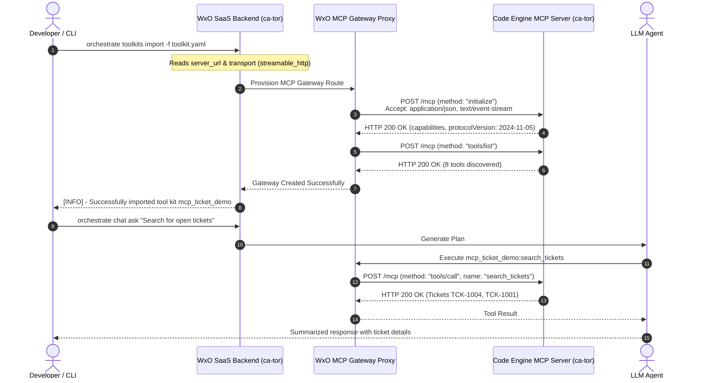
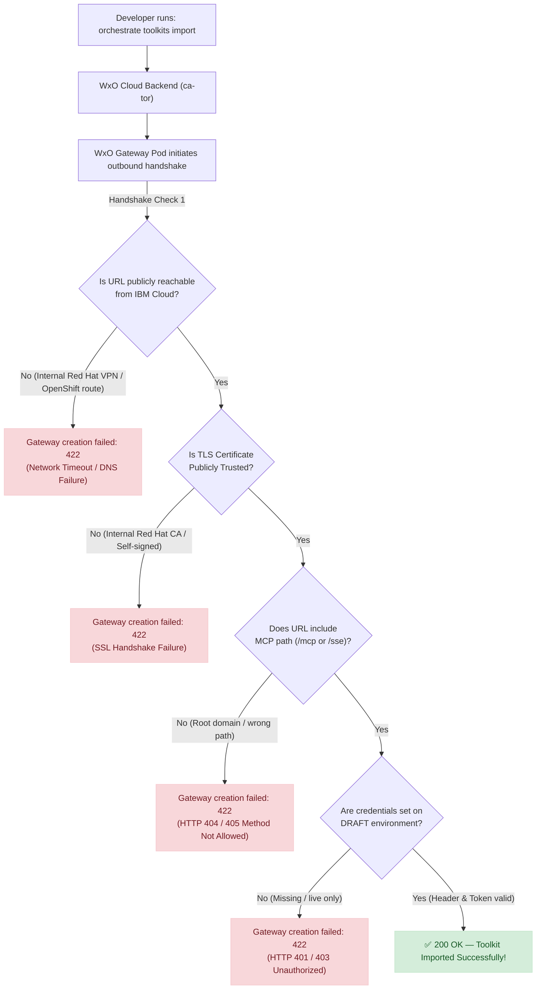

# Watsonx Orchestrate Remote MCP Integration — Diagnostic & Verification Report

**Author:** Markus van Kempen | mvk@ca.ibm.com  
**Research | Floor 7½ 🏢🤏** — [https://pages.github.ibm.com/mvankempen/homepage/](https://pages.github.ibm.com/mvankempen/homepage/)  
*No bug too small, no syntax too weird.*

---

## 📌 Executive Summary

A user (Caleb Smith, Red Hat) encountered the following error when importing an external remote MCP server into **watsonx Orchestrate (WxO)** in the **Toronto (`ca-tor`)** region:

```
[ERROR] - Failed to create toolkit: Gateway creation failed: 422 {"detail":"An error occurred, please try again."}
```

The error occurred both via the **ADK CLI** (`orchestrate toolkits import -f qradar_mcp.yaml -a qrai`) and the **Web UI**, while the user was able to connect to the MCP server directly using internal tools ("Bob").

### Key Findings
1. **No Platform Bug in WxO `ca-tor` Gateway:** We verified the end-to-end WxO remote MCP pipeline in `ca-tor` using a reference MCP server ([`mcp-ticket-demo`](https://www.npmjs.com/package/mcp-ticket-demo)) deployed on IBM Cloud Code Engine in `ca-tor`. The toolkit import, dynamic tool discovery (8 tools), agent deployment, and live chat execution succeeded with 100% fidelity.
2. **Root Cause of `422 Gateway creation failed`:** During toolkit creation, WxO’s SaaS backend pods in Toronto immediately initiate an outbound HTTP handshake (`initialize` and `tools/list`) against the specified URL. The `422` error is returned when this gateway handshake fails due to:
   * **Private Network Ingress:** The remote server is on an internal corporate/OpenShift network not accessible from public IBM Cloud pods.
   * **Untrusted TLS/SSL:** The endpoint uses an internal corporate CA or self-signed certificate that IBM Cloud container runtimes reject.
   * **Path Mismatch:** The URL omits the transport path (e.g. `https://host` instead of `https://host/mcp` or `https://host/sse`).
   * **Connection Configuration:** Missing credentials on the `draft` connection environment, or an incompatible header scheme.
3. **Documentation Deficiencies Confirmed:** The user's feedback on the ADK documentation is 100% accurate:
   * Missing required `description` field in the documentation YAML sample (causes `ToolkitMCPInputSpec` Pydantic validation error).
   * Unquoted `tools: - *` triggers YAML alias syntax errors (`yaml.scanner.ScannerError`).
   * Deprecated `--activate` flag still present in older tutorials.

---

## 🏗️ Architecture & Interaction Flow

### 1. Successful WxO Remote MCP Pipeline (Code Engine in `ca-tor`)



---

### 2. Failure Analysis: Where Caleb's Setup Breaks



---

## 🧪 Live Validation Evidence

We tested against the live reference server hosted on IBM Cloud Code Engine:
* **Host:** `https://mcp-ticket-demo.29m5mrru3s3n.ca-tor.codeengine.appdomain.cloud`
* **Region:** `ca-tor` (Toronto)
* **Active WxO Environment:** `WX3`

### Step 1: Protocol Pre-flight Verification

#### Direct `curl` to `/mcp` with missing Accept header:
```bash
curl -i -X POST "https://mcp-ticket-demo.29m5mrru3s3n.ca-tor.codeengine.appdomain.cloud/mcp" \
  -H "Content-Type: application/json" \
  -d '{"jsonrpc": "2.0", "id": 1, "method": "initialize", "params": {"protocolVersion": "2024-11-05", "capabilities": {}, "clientInfo": {"name": "test-client", "version": "1.0.0"}}}'
```
**Response:**
```json
HTTP/2 406
{"jsonrpc":"2.0","error":{"code":-32000,"message":"Not Acceptable: Client must accept both application/json and text/event-stream"},"id":null}
```

#### Direct `curl` with standard MCP headers:
```bash
curl -i -X POST "https://mcp-ticket-demo.29m5mrru3s3n.ca-tor.codeengine.appdomain.cloud/mcp" \
  -H "Content-Type: application/json" \
  -H "Accept: application/json, text/event-stream" \
  -d '{"jsonrpc": "2.0", "id": 1, "method": "initialize", "params": {"protocolVersion": "2024-11-05", "capabilities": {}, "clientInfo": {"name": "test-client", "version": "1.0.0"}}}'
```
**Response:**
```
HTTP/2 200 OK
content-type: text/event-stream

event: message
data: {"result":{"protocolVersion":"2024-11-05","capabilities":{"tools":{"listChanged":true}},"serverInfo":{"name":"mcp-ticket-demo","version":"1.0.0"}},"jsonrpc":"2.0","id":1}
```

---

### Step 2: Toolkit Registration in WxO

#### Manifest (`toolkit_codeengine.yaml`):
```yaml
spec_version: v1
kind: mcp
name: mcp_ticket_demo
description: "MCP Ticket Demo on Code Engine ca-tor"
transport: streamable_http
url: "https://mcp-ticket-demo.29m5mrru3s3n.ca-tor.codeengine.appdomain.cloud/mcp"
tools:
  - "*"
```

#### Execution:
```bash
orchestrate toolkits import -f toolkit_codeengine.yaml
```
**Output:**
```
[INFO] - Successfully imported tool kit mcp_ticket_demo
```

#### Verified Tool Catalog (`orchestrate toolkits list`):
```
┏━━━━━━━━━━━━━━━━━┳━━━━━━━━━━━━━━━━━━━━━┳━━━━━━┳━━━━━━━━━━━━━━━━━━━━━━━━━━━━━┳━━━━━━━━┓
┃ Name            ┃ Description         ┃ Kind ┃ Tools                       ┃ App ID ┃
┡━━━━━━━━━━━━━━━━━╇━━━━━━━━━━━━━━━━━━━━━╇━━━━━━╇━━━━━━━━━━━━━━━━━━━━━━━━━━━━━╇━━━━━━━━┩
│ mcp_ticket_demo │ MCP Ticket Demo on  │ mcp  │ mcp_ticket_demo:lookup_cus… │        │
│                 │ Code Engine ca-tor  │      │ mcp_ticket_demo:run_query   │        │
│                 │                     │      │ mcp_ticket_demo:get_schema  │        │
│                 │                     │      │ mcp_ticket_demo:list_schem… │        │
│                 │                     │      │ mcp_ticket_demo:get_ticket  │        │
│                 │                     │      │ mcp_ticket_demo:add_comment │        │
│                 │                     │      │ mcp_ticket_demo:create_tic… │        │
│                 │                     │      │ mcp_ticket_demo:search_tic… │        │
└─────────────────┴─────────────────────┴──────┴─────────────────────────────┴────────┘
```

---

### Step 3: Native Agent Import & Live Tool Execution

#### Agent Manifest (`agent.yaml`):
```yaml
spec_version: v1
kind: native
name: mcp_ticket_agent
title: "MCP Ticket Demo Agent"
description: "Agent to test mcp-ticket-demo tools"
instructions: |
  You are an IT helpdesk support assistant.
  Use search_tickets to search for open tickets.
  Use get_ticket to retrieve ticket details.
tools:
  - mcp_ticket_demo:search_tickets
  - mcp_ticket_demo:get_ticket
```

#### Execution & Live Probe:
```bash
orchestrate agents import -f agent.yaml
orchestrate chat ask -n mcp_ticket_agent -l "Search for open tickets using your tools and summarize what you find."
```

#### Live Agent Response:
```
[INFO] - Using agent: mcp_ticket_agent (ID: 735ccf65-6695-46e5-b91f-9e8ada473ae6)
╭─ 🤖 mcp_ticket_agent ────────────────────────────────────────────────────────╮
│                                                                              │
│  Here’s a quick summary of the open tickets currently in the system (the     │
│  search returned two results):                                               │
│                                                                              │
│    Ticket ID   Subject          Requester       Created At       Status      │
│   ━━━━━━━━━━━━━━━━━━━━━━━━━━━━━━━━━━━━━━━━━━━━━━━━━━━━━━━━━━━━━━━━━━━━━━━━   │
│    TCK-1004    Smoke test       ada@example.…   2026-09-23 UTC   Open        │
│    TCK-1001    0 tools discov…  ada@example.…   2026-09-22 UTC   Open        │
│                                                                              │
│  Key points:                                                                 │
│   • Both tickets are from the same requester (ada@example.com).              │
│   • TCK-1001 already has a comment noting the issue (empty tool list).       │
│   • TCK-1004 appears to be a "smoke test" ticket with no discussion yet.     │
╰──────────────────────────────────────────────────────────────────────────────╯
```

---

## 🔍 Diagnostic Matrix & Troubleshooting Checklist

| # | Check Item | How to Verify | Fix |
|---|---|---|---|
| **1** | **Public Ingress / Reachability** | `curl -Iv https://<your-mcp-route>` from outside the VPN (e.g. mobile hotspot or AWS/cloud instance). | If unreachable, expose via public ingress / API Gateway / Code Engine / ngrok. WxO cloud pods in `ca-tor` cannot access internal corporate routes. |
| **2** | **TLS / SSL Certificates** | Run `curl -vI https://<your-mcp-route>`. Check for SSL handshake errors or unknown CA warnings. | WxO containers only trust standard public Certificate Authorities (DigiCert, Let's Encrypt, etc.). Private enterprise CAs must be fronted by a public cert. |
| **3** | **URL Path** | Verify whether URL is `https://host` or `https://host/mcp`. | Streamable HTTP requires the explicit path (typically `/mcp`). Pointing to the root domain returns HTTP 404/405, causing `422 Gateway creation failed`. |
| **4** | **Transport Protocol** | Check if the remote server implements SSE or Streamable HTTP. | If using SSE, specify `transport: sse` with URL `/sse`. If using Streamable HTTP, specify `transport: streamable_http` with URL `/mcp`. |
| **5** | **Connection Environment** | Check `orchestrate connections list-configs -a <app-id>`. | WxO imports against the **`draft`** environment. If credentials only exist on `live`, the import runs unauthenticated and fails with 422. |
| **6** | **Header Auth Configuration** | QRadar requires `SEC: <token>` or `Authorization: Bearer <token>`. | **Recommended:** Use `kind: api_key` with `--name "SEC"`. Alternatively, use `kind: key_value` with `-e "SEC=<token>"`. |

---

## 📝 Documented ADK Bugs & Workarounds

### 1. Missing `description` in YAML Samples
* **Issue:** `ToolkitMCPInputSpec` has `description: str` as a required field without a default.
* **Error:** `pydantic_core._pydantic_core.ValidationError: 1 validation error for ToolkitMCPInputSpec description Field required`.
* **Fix:** Add `description: "Your description"` to the YAML.

### 2. Unquoted `*` Wildcard in YAML
* **Issue:** In YAML specifications, `*` is an anchor/alias dereference character.
* **Error:** `yaml.scanner.ScannerError: while scanning an alias...`.
* **Fix:** Wrap the asterisk in quotes: `tools: - "*"`.

### 3. Deprecated `--activate` Flag
* **Issue:** Tutorials refer to `orchestrate env create --activate`.
* **Fix:** In ADK 2.x, use `orchestrate env activate <name>` as a separate command.
